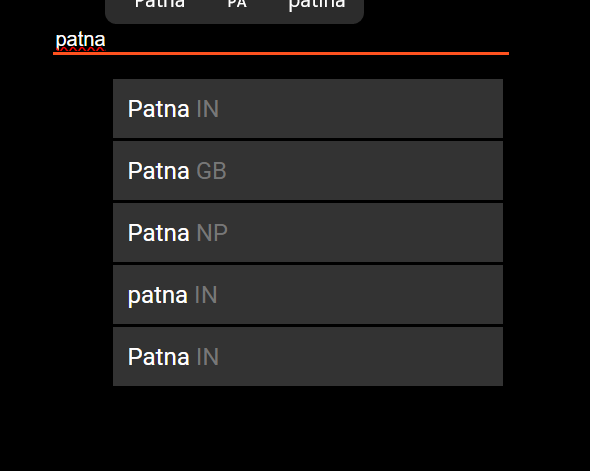
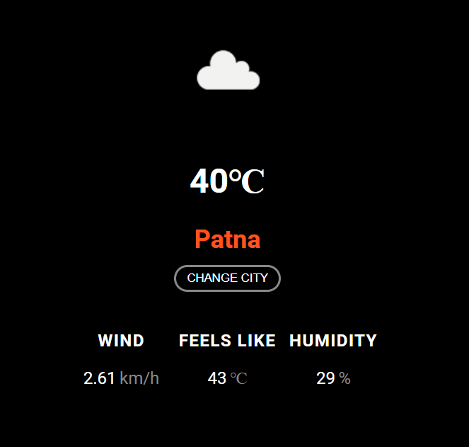
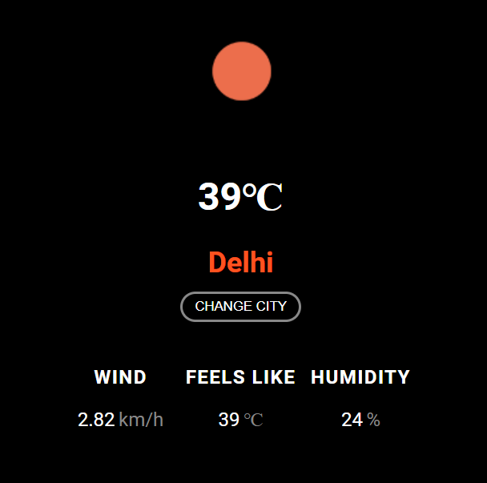

# Get Weather Info project

A simple weather application built using **HTML**, **CSS**, and **JavaScript**.  
This app uses the **OpenWeatherMap API** to fetch real-time weather data including temperature, wind speed, humidity, and weather icons for any searched city.

## Features

-  Live city search suggestions
-  Displays current temperature in Celsius
-  Shows wind speed and humidity
-  Weather icon based on real conditions
-  Debounced input for smoother searching
-  Saves last searched city using localStorage
-  Easily change the city at any time

## Technologies Used

- HTML5
- CSS3
- JavaScript (ES6+)
- [OpenWeatherMap API](https://openweathermap.org/api)
- [Lodash.js](https://lodash.com/) (for debounce)


## Screenshot

 
 
  


## Project Structure

weather-app/
├── index.html 
├── style.css 
├── script.js 
├── README.md 
├── assets/
    └── screenshot.png 


## How It Works

-User types a city in the search input.
-API fetches matching city suggestions.
-Clicking a city shows current weather using One Call API.
-Weather data (temp, wind, humidity) and icon are displayed.
-Last selected city is saved in localStorage and shown on reload.


### Clone the repository

```bash
git clone https://github.com/Supriyasharma12/Get_Weather_Info.git
cd weather-app


